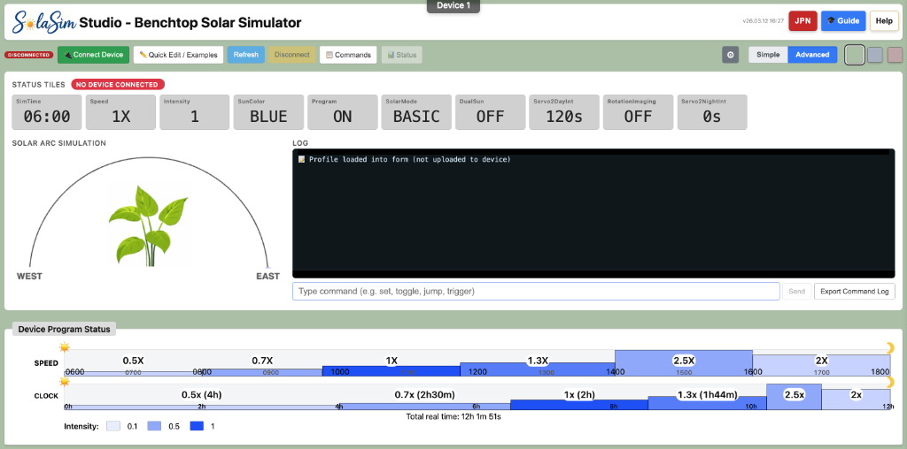

# 🌞 SolaSim — Open-Source Solar Simulator

<p align="center">
  
</p>

**SolaSim** is an open-source solar simulator for phototaxis research. It uses LED panels and "sun" tracking on a semi-circular array of LED panels to recreate realistic daylight cycles — from simple sunrise-to-sunset sequences to multi-day scientific simulations based on real latitude and date.

Built with MicroPython firmware and using a browser-based control interface, it's designed to be affordable, reproducible, and accessible to researchers and educators.

<p align="center">
  
</p>

---

## ✨ Key Features

- **Solar Simulation Modes** — BASIC (fixed 6 AM–6 PM) and SCIENTIFIC (astronomical calculations from latitude/date)
- **Multi-Step Programs** — Sequences with per-step speed, intensity, sun colour, hold/repeat, and multi-day support
- **360° Rotation Imaging** — Servo-driven turntable with camera trigger for time-lapse and stills capture
- **Browser-Based Control** — Connect via USB from Chrome/Edge/Opera using Web Serial
- **Real-Time Monitoring** — Live status tiles, solar arc visualisation, interactive timeline with playhead
- **Profile Management** — Save, load, compare, and share experiment profiles
- **English & Japanese UI** — Full bilingual interface with one-click toggle

---

## 🌐 Try It Now

The web interface is hosted on GitHub Pages — no installation required:

👉 **[odeepllama.github.io/SolarSim/](https://odeepllama.github.io/SolarSim/)** — Open in Chrome, Edge, or Opera and connect to your device via USB.

> **Note:** The Web Serial API requires a Chromium-based browser. See the in-app Help panel for details.

---

## 🏗️ Architecture

```
┌────────────────────────────────┐
│     SolaSimStudio.html         │
│     (Web Serial API)           │
│     Chrome / Edge / Opera      │
└──────────────┬─────────────────┘
               │ USB Serial
┌──────────────▼─────────────────┐
│  RP2040 Firmware               │  ← Recommended
│  (RP2040/)                     │
│  Single-file MicroPython       │
└────────────────────────────────┘
┌────────────────────────────────┐
│  ESP32-S3 Firmware             │  ← Experimental
│  (ESP32/)                      │
│  Modular MicroPython           │
└────────────────────────────────┘
```

---

## 📂 Repository Structure

| Folder / File | Description |
|--------|-------------|
| `SolaSimStudio.html` | **Web interface** — browser-based control panel (USB via Web Serial) |
| `RP2040/` | **RP2040 firmware** — recommended, single-file MicroPython |
| `ESP32/` | ESP32-S3 firmware (modular MicroPython) |

| `Profiles/` | Example experiment profiles |

---

## 🔧 Hardware Requirements

- **Microcontroller**: RP2040 (recommended) or ESP32-S3
- **LED Panels**: NeoPixel/WS2812B addressable 8x8 LED matrices
- **Servos**: For 360° rotation platform and camera triggering (metal gear servos recommended)
- **OLED Display**: SSD1306 128×64 for on-device status with ESP32-S3 (optional)
- **Camera Trigger**: Optional Bluetooth camera trigger for use with smartphones
- **3D-Printed Parts**: Housing and mounting components ([Printable STL files](https://www.printables.com/model/1632518-solarsim-an-inexpensive-open-source-benchtop-solar))

> 📋 Full parts list: Bill of Materials — coming soon!

---

## 🚀 Getting Started

### 1. Flash MicroPython Firmware

Flash the RP2040 with **MicroPython v1.27.0** — the `.uf2` firmware file is included in `RP2040/`. Hold the BOOTSEL button, plug in USB, and drag the `.uf2` file to the drive that appears.

> **Note:** SolaSim is tested with MicroPython **v1.27.0** (2025-12-09). Other versions may work but are not guaranteed.

### 2. Upload Project Files

Upload `main.py` and `main_app.mpy` from the `RP2040/` folder to the device.

**Option A** — Using [Thonny](https://thonny.org/) (recommended for beginners):

1. Open Thonny and select **MicroPython (RP2040)** as the interpreter
2. Navigate to the `RP2040/` folder in Thonny's file browser
3. Right-click `main.py` and `main_app.mpy` and choose **Upload to /**

**Option B** — Using [mpremote](https://docs.micropython.org/en/latest/reference/mpremote.html) (command line):

```bash
cd RP2040
mpremote connect /dev/YOUR_PORT cp main.py main_app.mpy :
```

> **💡 For developers:** `main_app.mpy` is pre-compiled from `SolarSimulatorSun.py` using [mpy-cross](https://pypi.org/project/mpy-cross/). If you modify the source, rebuild it with:
>
> ```bash
> pip install mpy-cross
> mpy-cross SolarSimulatorSun.py -o main_app.mpy
> ```
>
> The `.mpy` bytecode format is required because the RP2040 has limited RAM and cannot compile the full `.py` file on-device without running out of memory.

### 3. Connect via Browser

Open [SolaSim Studio](https://odeepllama.github.io/SolarSim/) in Chrome, Edge, or Opera and click **Connect to Device**.

---

## 📖 Documentation

- **In-App Help**: Click the **Help** button in the web interface for a full interactive guide

---

## 🤝 Contributing

This is a research project in active development. Contributions, suggestions, and bug reports are welcome! Please open an [Issue](https://github.com/odeepllama/SolarSim/issues) to get started.

---

## 📜 License

This project is licensed under the **GNU General Public License v3.0** — see the [LICENSE](LICENSE) file for details.

---

## 🙏 Acknowledgements

Developed at [Akita International University](https://web.aiu.ac.jp/en/) with AI-assisted development using VS Code, GitHub Copilot, and Google Gemini.

---

<p align="center">
  <em>Bringing the sun indoors for plant science 🌱</em>
</p>
