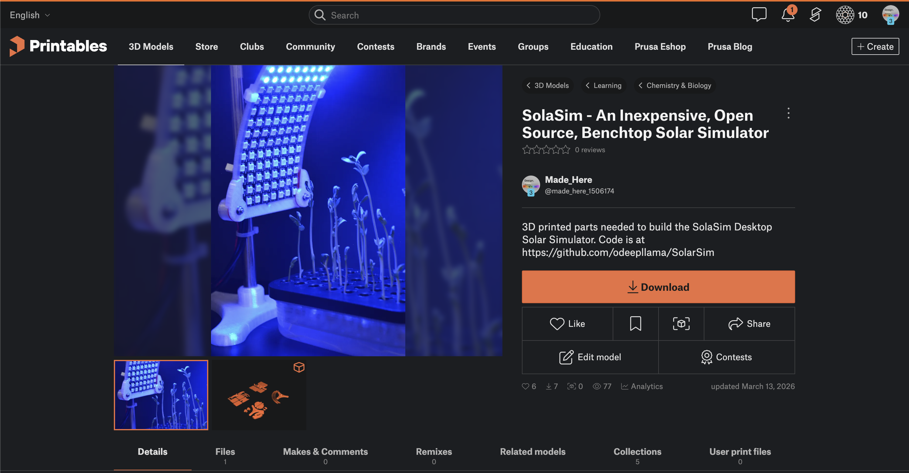

# 🌞 SolaSim — Open-Source Solar Simulator

<p align="center">
  
</p>

**SolaSim** is an open-source solar simulator for phototaxis research. It uses LED panels and "sun" tracking on a semi-circular array of LED panels to recreate realistic daylight cycles — from simple sunrise-to-sunset sequences to multi-day scientific simulations based on real latitude and date.

Built with MicroPython firmware and using a browser-based control interface, it's designed to be affordable, reproducible, and accessible to researchers and educators.

<p align="center">
  
</p>

---

## ✨ Key Features

- **Solar Simulation Modes** — BASIC (fixed 6 AM–6 PM) and SCIENTIFIC (astronomical calculations from latitude/date)
- **Multi-Step Programs** — Sequences with per-step speed, intensity, sun colour, hold/repeat, and multi-day support
- **360° Rotation Imaging** — Servo-driven turntable with camera trigger for time-lapse and stills capture
- **Browser-Based Control** — Connect via USB from Chrome/Edge/Opera using Web Serial
- **Real-Time Monitoring** — Live status tiles, solar arc visualisation, interactive timeline with playhead
- **Demo Mode** — Preview and validate your program with an animated timeline — no hardware needed
- **Profile Management** — Save, load, compare, and share experiment profiles
- **English & Japanese UI** — Full bilingual interface with one-click toggle

---

## 🌐 Try It Now

The web interface is hosted on GitHub Pages — no installation required:

👉 **[odeepllama.github.io/SolarSim/](https://odeepllama.github.io/SolarSim/)** — Open in Chrome, Edge, or Opera and connect to your device via USB.

> **Note:** The Web Serial API requires a Chromium-based browser. See the in-app Help panel for details.
>
> 💡 **No device yet?** Click **▶ Demo** to preview programs without hardware — great for learning the interface and validating step sequences.

---

## 🏗️ Architecture

```
┌────────────────────────────────┐
│     SolaSimStudio.html         │
│     (Web Serial API)           │
│     Chrome / Edge / Opera      │
└──────────────┬─────────────────┘
               │ USB Serial
┌──────────────▼─────────────────┐
│  RP2040 Firmware               │  ← Recommended
│  (RP2040/)                     │
│  Single-file MicroPython       │
└────────────────────────────────┘
┌────────────────────────────────┐
│  ESP32-S3 Firmware             │  ← Experimental
│  (ESP32/)                      │
│  Modular MicroPython           │
└────────────────────────────────┘
```

---

## 📂 Repository Structure

| Folder / File | Description |
|--------|-------------|
| `SolaSimStudio.html` | **Web interface** — browser-based control panel (USB via Web Serial) |
| `setup.html` | **Setup Wizard** — browser-based firmware installer for RP2040 |
| `RP2040/` | **RP2040 firmware** — recommended, single-file MicroPython |
| `ESP32/` | ESP32-S3 firmware (modular MicroPython) |
| `Profiles/` | Example experiment profiles |
| `docs/` | Hardware documentation (pin reference, NeoPixel wiring) |
| `CONTRIBUTING.md` | Contribution guidelines for developers |

---

## 🔧 Hardware Requirements

- **Microcontroller**: [RP2040:bit](https://spotpear.com/index/study/detail/id/943.html) (recommended) or ESP32-S3
- **LED Panels**: NeoPixel/WS2812B addressable 8x8 LED matrices
- **Servos**: For 360° rotation platform and camera triggering (metal gear servos recommended)
- **OLED Display**: SSD1306 128×64 for on-device status with ESP32-S3 (optional)
- **Camera Trigger**: Optional Bluetooth camera trigger for use with smartphones
- **3D-Printed Parts**: Housing and mounting components ([Printable STL files](https://www.printables.com/model/1632518-solarsim-an-inexpensive-open-source-benchtop-solar))

<p align="center">
  <a href="https://www.printables.com/model/1632518-solarsim-an-inexpensive-open-source-benchtop-solar">
    
  </a>
</p>

> 📋 Full parts list: Bill of Materials — coming soon!

---

## 🚀 Getting Started

### Quick Setup (Recommended)

Use the browser-based setup wizard — no software installation required:

👉 **[SolaSim Setup Wizard](https://odeepllama.github.io/SolarSim/setup)** — Open in Chrome/Edge/Opera and follow the guided steps to flash firmware and deploy files.

### Manual Setup (Advanced)

If you prefer to set up manually without the wizard:

> **Note:** The Setup Wizard supports **RP2040 only**. For ESP32-S3 setup, see the `ESP32/` folder and flash using `esptool`.

1. **Flash MicroPython Firmware**: Flash the RP2040 with **MicroPython v1.27.0** — the `.uf2` firmware file is included in `RP2040/`. Hold the BOOTSEL button, plug in USB, and drag the `.uf2` file to the drive that appears.
2. **Upload Project Files**: Copy `main.py` and `main_app.mpy` from `RP2040/` to the device using [Thonny](https://thonny.org/) or [mpremote](https://docs.micropython.org/en/latest/reference/mpremote.html).
3. **Connect**: Open [SolaSim Studio](https://odeepllama.github.io/SolarSim/) in Chrome, Edge, or Opera and click **Connect to Device**.

> **Note:** SolaSim is tested with MicroPython **v1.27.0** (2025-12-09). Other versions may work but are not guaranteed.

### No Hardware Yet?

You can design and preview programs entirely in the browser. Open [SolaSim Studio](https://odeepllama.github.io/SolarSim/), build your program steps, then click **▶ Demo** to simulate the sequence with an animated timeline playhead. Use Step/Day navigation to jump through your program and verify timing before building hardware.

> **💡 For developers:** `main_app.mpy` is pre-compiled from `SolarSimulator.py` using [mpy-cross](https://pypi.org/project/mpy-cross/). If you modify the source, rebuild it with:
>
> ```bash
> pip install mpy-cross
> mpy-cross SolarSimulator.py -o main_app.mpy
> ```
>
> The `.mpy` bytecode format is required because the RP2040 has limited RAM and cannot compile the full `.py` file on-device without running out of memory.

---

## 📖 Documentation

- **In-App Help**: Click the **Help** button in the web interface for a full interactive guide
- **[Pin Reference](docs/pin_reference.md)** — GPIO pin assignments for RP2040 and ESP32-S3
- **[NeoPixel Wiring](docs/neopixel_wiring.md)** — LED panel daisy-chain wiring and power setup

---

## 🤝 Contributing

This is a research project in active development. Contributions, suggestions, and bug reports are welcome! Please open an [Issue](https://github.com/odeepllama/SolarSim/issues) to get started.

---

## 📜 License

This project is licensed under the **GNU General Public License v3.0** — see the [LICENSE](LICENSE) file for details.

---

## 🙏 Acknowledgements

Developed at [Akita International University](https://web.aiu.ac.jp/en/) with AI-assisted coding in VS Code, GitHub Copilot Pro (Educational access), and Google Antigravity / Claude Opus 4.6 (Thinking).

---

<p align="center">
  <em>Bringing the sun indoors for plant science 🌱</em>
</p>
