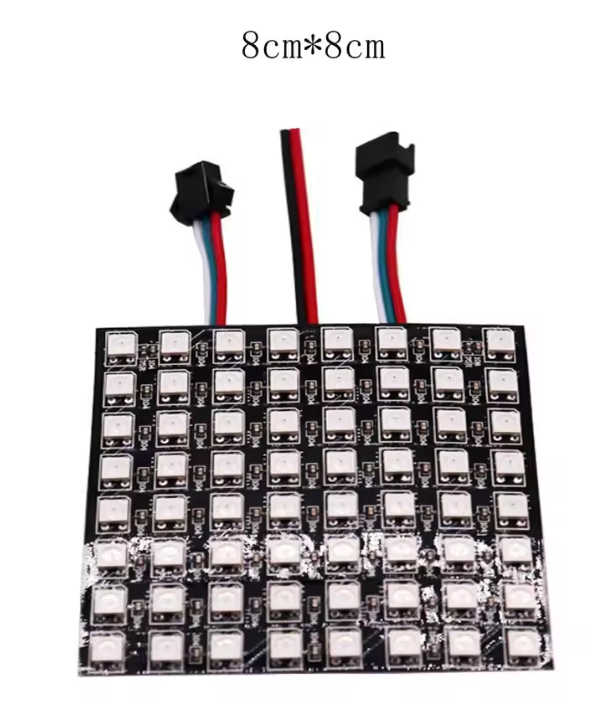

# NeoPixel Panel Array Wiring

## Panel Type

SolaSim uses **WS2812B addressable 8×8 LED matrices** (8 cm × 8 cm) arranged in a semi-circular arc to simulate the sun's path across the sky.

Each panel has two 3-pin JST connectors on the rear:

- **DIN** (Data In) — left connector when viewed from behind (cables exiting to the right)
- **DOUT** (Data Out) — right connector when viewed from behind

<p align="center">
  
</p>

## Daisy-Chain Wiring

The panels are wired in a left-to-right daisy chain (as viewed from behind):

```
                      ┌──────────┐   ┌──────────┐   ┌──────────┐
  RP2040              │ Panel 0  │   │ Panel 1  │   │ Panel 2  │   ...
  NeoPixel Pin ──────►│DIN  DOUT─┼──►│DIN  DOUT─┼──►│DIN  DOUT─┼──► ...
                      │ (LEFT)   │   │          │   │          │
                      └──────────┘   └──────────┘   └──────────┘

                      ◄──── viewed from behind, cables exiting right ────►
```

1. The **RP2040 data pin** connects to **DIN** on the leftmost panel (Panel 0)
2. **DOUT** of each panel connects to **DIN** of the next panel to the right
3. The chain continues for all panels in the arc

## Pin Assignments

| Signal | RP2040 Pin | ESP32-S3 Pin |
|--------|-----------|--------------|
| NeoPixel Data | *TBD* | *TBD* |

## Power

The panels are powered via **3 USB cables**, each supplying 5V to every other panel along the chain. This distributes the current draw and avoids overloading a single source.

```
USB Cable 1 ──► Panel 0, Panel 1
USB Cable 2 ──► Panel 2, Panel 3
USB Cable 3 ──► Panel 4, Panel 5
```

- Connect the **+** and **−** (5V and GND) wires from each USB cable to the power pads on the corresponding panels
- Ensure **GND is shared** between all USB power sources and the microcontroller
- Each WS2812B LED draws up to **60 mA** at full white brightness; an 8×8 panel (64 LEDs) can draw up to **3.84 A** at maximum
- SolaSim can run at **full brightness** as long as all three USB power inputs are connected, each providing approximately **~1A**

## Notes

- Panel index order in the daisy chain maps directly to the simulated sun position along the arc
- The firmware addresses each panel sequentially — Panel 0 is the westernmost position, with increasing indices moving eastward
